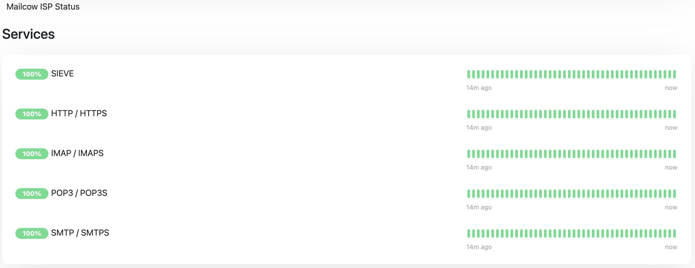

```mermaid
graph TD
    subgraph " "
        direction LR
        subgraph "👤 End Users / Utilisateurs"
            UC_Heavy[/"<br>Mail Client<br>(Outlook, Thunderbird)"/]
            UC_Web[/"<br>Webmail<br>(SOGo)"/]
        end
    end

    style UC_Heavy fill:#d4e6f1,stroke:#333,stroke-width:2px
    style UC_Web fill:#d4e6f1,stroke:#333,stroke-width:2px

    FIP[/"<b>🌐 Floating IP<br>🌐 IP Flottante</b><br>mail.domain.tld"/]
    style FIP fill:#2ECC71,color:#fff,stroke:#333,stroke-width:2px

    UC_Heavy -- "IMAPS / SMTPS" --> FIP
    UC_Web -- "HTTPS" --> FIP

    subgraph "🖥️ Mailcow HA Application Cluster"
        direction LR

        subgraph "Node 1 (MASTER)"
            id1["<b>Mailcow Docker</b><br>MariaDB (Galera)<br>Keepalived"]
        end

        subgraph "Node 2 (BACKUP)"
            id2["Mailcow Docker<br>MariaDB (Galera)<br>Keepalived"]
        end

        subgraph "Node 3 (BACKUP)"
            id3["Mailcow Docker<br>MariaDB (Galera)<br>Keepalived"]
        end
    end

    subgraph "💾 Data Storage / Stockage des Données"
        direction TB
        
        %% Nœuds de titre pour éviter la superposition %%
        TitleFiles["<b>File Storage (Floating) / Stockage Fichiers (Flottant)</b>"]
        TitleDB["<b>Database Storage (Distributed) / Stockage BDD (Distribué)</b>"]
        style TitleFiles fill:none,stroke:none,color:#333,font-weight:bold
        style TitleDB fill:none,stroke:none,color:#333,font-weight:bold

        SharedVol[(" <br>Shared Volume / Volume Partagé<br>(Emails, Index, Certs...)")]
        style SharedVol fill:#f9e79f,stroke:#333,stroke-width:2px

        subgraph " "
            direction LR
            DBVol1[(" <br>Volume DB 1")]
            DBVol2[(" <br>Volume DB 2")]
            DBVol3[(" <br>Volume DB 3")]
        end
        style DBVol1 fill:#aed6f1,stroke:#333,stroke-width:2px
        style DBVol2 fill:#aed6f1,stroke:#333,stroke-width:2px
        style DBVol3 fill:#aed6f1,stroke:#333,stroke-width:2px
        
        TitleFiles --> SharedVol
        SharedVol --> TitleDB
        TitleDB --> DBVol1
    end
    
    FIP -- "<b>Active Traffic / Trafic Actif</b>" --> id1

    id1 -- "<b>Mounted Volume / Volume Monté</b>" --> SharedVol
    id2 -.-> SharedVol
    id3 -.-> SharedVol

    id1 -- "Static Volume / Volume Statique" --> DBVol1
    id2 -- "Static Volume / Volume Statique" --> DBVol2
    id3 -- "Static Volume / Volume Statique" --> DBVol3

    subgraph "🔒 Private Network / Réseau Privé"
        PrivateNet(( ))
        style PrivateNet fill:#333,stroke:#fff,stroke-width:0px
    end

    DBVol1 <==> PrivateNet
    DBVol2 <==> PrivateNet
    DBVol3 <==> PrivateNet
    PrivateNet -- "<b>Galera Replication</b>" --> DBVol1
    
    subgraph "📊 External Monitoring / Surveillance Externe"
        Kuma(("<br>Uptime Kuma"))
        style Kuma fill:#e8daef,stroke:#333,stroke-width:2px
    end

    Kuma -- "HTTP/S Probe / Sonde HTTP/S" --> FIP

    subgraph "<b>🧠 Keepalived</b>"
      KA_Control((<b>Keepalived</b><br>on Hosts / sur les Hôtes))
      style KA_Control fill:#f5b7b1,stroke:#c0392b,stroke-width:2px
    end
    
    id1 -. "<b>monitor.sh</b>" .-> KA_Control
    
    KA_Control -- "master.sh<br>backup.sh" --> FIP
    KA_Control -- "master.sh<br>backup.sh" --> SharedVol
```
    

<h1 align="center">Mailcow ISP</h1>

&nbsp;

  
  
  
  
  
  
  

## 🇬🇧 English - Mailcow ISP (mailcow High Availability)

This repository provides a complete and production-ready solution for deploying a **high-availability (HA) Active/Passive Mailcow cluster**.  
The architecture is designed to automate failover and minimize downtime during a node failure, ensuring business continuity for your mail services.

## 🇫🇷 Français - Mailcow ISP (mailcow Haute Disponibilité)

Ce projet fournit une solution complète et prête pour la production pour déployer un **cluster Mailcow en haute disponibilité (HA) de type Actif/Passif.**  
L’architecture est conçue pour automatiser le basculement et minimiser le temps d’indisponibilité en cas de panne d’un nœud, assurant ainsi la continuité de service pour votre messagerie.

---

---

## 🇬🇧 English - Mailcow High Availability (Mailcow-HA)

Tired of your Mailcow mail server going down at the slightest failure? This project transforms a standard Mailcow instance into a **professional-grade high availability cluster**, ensuring near-perfect service continuity.

We focused on what Mailcow doesn't provide natively: **high availability**. This solution integrates with a standard Mailcow installation without modifying its core, thus ensuring **full compatibility with future updates**.

⚠️ **Compatibility Note:** This solution is currently **exclusively designed for the Hetzner Cloud environment** due to its use of Volumes and Floating IPs via the Hetzner API. Expanding to other providers or universal solutions like Proxmox will be considered based on the project's success.

---

### ✨ Why Choose Mailcow-HA?

The goal is simple: peace of mind. Forget waking up in the middle of the night because a container crashed.

#### 🛡️ Absolute Fault Tolerance
Absolutely **no human intervention** is required. The cluster detects failures and automatically fails over in the event of:
*   **Hardware or network failure** of a node.
*   **Malfunction of a Mailcow container** (e.g., `postfix`, `dovecot`, etc.).
*   **Degradation of the Galera database cluster**.

#### ⚡ A Few-Second Failover Time 
In the event of a failure, the service is operational again in **only a few seconds**, depending on your server’s performance. This is the time it takes for our orchestrator to:
1.  Stop critical services on the failed node.
2.  Detach the shared storage volume.
3.  Attach the volume to a standby node.
4.  Attach the Floating IP to the same node.
5.  Restart essential services.

Users experience only a minimal, often imperceptible, service interruption.

---

### 🚀 Key Features

This project isn't just a collection of scripts; it's an integrated solution.

#### 📝 Automatic Sign-up Portal (Gmail-Style)
Offer your users a modern and seamless sign-up experience. This custom-developed page integrates perfectly with the Mailcow ecosystem.
*   **Instant account creation** for your friends or users.
*   **Secured by Captcha** to prevent bots.
*   **Automatic generation of a secure password**.
*   **Multi-language** support with a **light/dark mode**.
*   **100% compliant with the Mailcow graphic charter**, using its own templating system for perfect visual integration.

 

    
#### 📈 Proven Scalability
The architecture is designed to grow with your needs.
*   The cluster defaults to **3 nodes** but can be extended to 5, 7, or more for increased resilience.
*   A **single access point** (e.g., `mail.domain.tld) is provided via a Floating IP managed by Mailcow-HA, regardless of the number of nodes in the cluster.

#### 📊 Real-Time Monitoring and Alerts
Know what's happening, when it's happening, without being flooded with notifications.
*   **Internal monitoring** with a customizable alert system (via a simple PHP webhook, you can notify by email, SMS, etc.).
*   **Smart Alerts:** You are notified of critical events (failover start, failure, node promotion to `MASTER`/`BACKUP`) without receiving unnecessary noise.
*   **Compatibility with external tools** like Uptime Kuma for end-to-end monitoring.
*   **Comprehensive system logs** (`journalctl`) allowing you to integrate your own monitoring solution if desired.

### 🏛️ Cluster Architecture

The robustness of Mailcow-HA is built on four fundamental pillars:

1.  **Failover Orchestration (Keepalived)**
    - Keepalived manages the cluster state and the Floating IP.
    - It uses an intelligent monitoring script (`monitor.sh`) with a grace period to check the health of the Mailcow stack and prevent false positives.
    - In case of failure, it executes `master.sh` or `backup.sh` scripts to orchestrate the failover.

2.  **Resilient Database (External Galera Cluster)**
    - A 3-node (or more) MariaDB Galera Cluster eliminates the database as a single point of failure.
    - Communication between database nodes occurs over a **private network** for maximum security.

3.  **Data Persistence (Shared Block Storage)**
    - A single shared block storage volume (Hetzner Volume) holds all critical Mailcow data (emails, keys, IMAP indexes, Rspamd data, SSL certificates).
    - During a failover, this volume is reattached to the new master, guaranteeing **zero data loss**.

4.  **Security and Optimization**
    - The architecture is designed to work with **advanced firewall rules**, exposing only the strictly necessary ports.
    - A **circuit breaker** mechanism (`security_wait`) prevents an unstable cluster from causing continuous failover loops.

---

## 🇫🇷 Français

Fatigué de l'indisponibilité de votre serveur mail Mailcow à la moindre panne ? Ce projet transforme une instance Mailcow standard en un **cluster de haute disponibilité de qualité professionnelle**, garantissant une continuité de service quasi-parfaite.

Nous nous sommes focalisés sur ce que Mailcow ne fournit pas nativement : **la haute disponibilité**. Cette solution s'intègre à une installation Mailcow standard sans en modifier le cœur, assurant ainsi une **compatibilité totale avec les futures mises à jour**.

⚠️ **Note de compatibilité :** Actuellement, cette solution est **exclusivement conçue pour l'environnement Hetzner Cloud** en raison de son utilisation des Volumes et des IP Flottantes via l'API Hetzner. L'extension à d'autres fournisseurs ou des solutions comme Proxmox sera envisagée selon le succès du projet.

---

### ✨ Pourquoi Choisir Mailcow-HA ?

L'objectif est simple : la tranquillité d'esprit. Oubliez les réveils en pleine nuit parce qu'un conteneur a planté.

#### 🛡️ Tolérance de Panne Absolue
Absolument **aucune intervention humaine** n'est nécessaire. Le cluster détecte les pannes et bascule automatiquement en cas de :
*   **Panne matérielle** ou réseau d'un nœud.
*   **Dysfonctionnement d'un conteneur Mailcow** (ex: `postfix`, `dovecot`, etc.).
*   **Dégradation du cluster de base de données Galera**.

#### ⚡ Un temps de basculement de quelques secondes  
En cas de défaillance, le service redevient opérationnel en **à peine quelques secondes**, selon les performances de votre serveur. C’est le temps nécessaire à notre orchestrateur pour :
1.  Arrête les services critiques sur le nœud défaillant.
2.  Détache le volume de stockage partagé.
3.  Attache ce volume sur un nœud de secours.
4.  Attache l'IP Flottante sur ce même nœud.
5.  Redémarre les services essentiels.

Les utilisateurs ne subissent qu'une coupure minimale, souvent imperceptible.

---

### 🚀 Caractéristiques Principales

Ce projet n'est pas qu'une simple collection de scripts, c'est une solution intégrée.

#### 📝 Portail d'Inscription Automatique (Type Gmail)
Offrez à vos utilisateurs une expérience d'inscription moderne et instantanée. Cette page, développée sur mesure, s'intègre parfaitement à l'écosystème Mailcow.
*   **Création de compte instantanée** pour vos proches ou utilisateurs.
*   **Sécurisée par Captcha** pour éviter les bots.
*   **Génération automatique d'un mot de passe sécurisé**.
*   **Multi-langue** et avec un **mode clair/sombre**.
*   **100% conforme à la charte graphique de Mailcow**, utilisant son propre système de templates pour une intégration visuelle parfaite.

#### 📈 Scalabilité Éprouvée
L'architecture est pensée pour grandir avec vos besoins.
*   Le cluster est composé par défaut de **3 nœuds**, mais peut être étendu à 5, 7, ou plus pour une résilience accrue.
*   Un **point d'accès unique** (ex: `mail.domain.tld`) est fourni via une IP Flottante gérée par Mailcow-HA, quel que soit le nombre de nœuds dans le cluster.

#### 📊 Monitoring et Alertes en Temps Réel
Sachez ce qui se passe, quand ça se passe, sans être inondé de notifications.
*   **Monitoring interne** avec un système d'alerte personnalisable (via un simple webhook PHP, vous pouvez notifier par e-mail, SMS, etc.).
*   **Alertes intelligentes :** Vous êtes notifié des événements critiques (début d'une bascule, échec, promotion d'un nœud en `MASTER`/`BACKUP`) sans recevoir de bruit inutile.
*   **Compatibilité avec les outils externes** comme Uptime Kuma pour une surveillance de bout en bout.
*   **Logs système complets** (`journalctl`) permettant d'intégrer votre propre solution de supervision si vous le souhaitez.

 

    
### 🏛️ Architecture du Cluster

La robustesse de Mailcow-HA repose sur quatre piliers fondamentaux :

1.  **Orchestration du Basculement (Keepalived)**
    - Keepalived gère l'état du cluster et l'IP Flottante.
    - Il utilise un script de surveillance (`monitor.sh`) avec une période de grâce intelligente pour vérifier la santé de Mailcow et éviter les faux positifs.
    - En cas de panne, il exécute les scripts `master.sh` ou `backup.sh` pour orchestrer la bascule.

2.  **Base de Données Résiliente (Cluster Galera Externe)**
    - Un cluster MariaDB Galera à 3 nœuds (ou plus) élimine la base de données comme point de défaillance.
    - La communication entre les nœuds se fait sur un **réseau privé** pour une sécurité maximale.

3.  **Persistance des Données (Stockage Bloc Partagé)**
    - Un unique volume partagé (Hetzner Volume) contient toutes les données critiques de Mailcow (e-mails, clés, index IMAP, Rspamd, certificats SSL).
    - Lors d'un basculement, ce volume est réattaché au nouveau maître, garantissant **zéro perte de données**.

4.  **Sécurité et Optimisation**
    - L'architecture est conçue pour fonctionner avec des règles de **pare-feu** poussées, n'exposant que les ports strictement nécessaires.
    - Un mécanisme de **disjoncteur** (`security_wait`) empêche un cluster instable de provoquer des boucles de basculement continues.
