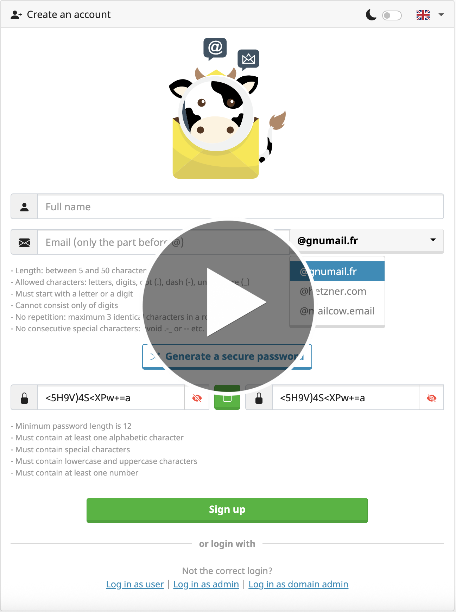

<div align="center">
    
</div>

<h1 align="center">Mailcow ISP</h1>

<p align="center">
    ⭐ If you like this project, <strong>consider giving it a star</strong> — it really keeps us motivated! ⭐<br>
    ⭐ Si ce projet vous plaît, <strong>pensez à lui mettre une étoile</strong> — ça nous motive énormément ! ⭐

<p>&nbsp;</p>

<p align="center">
   <a href="https://github.com/mailcow/mailcow-dockerized" target="_blank">
    
  </a>
  <a href="https://www.docker.com/" target="_blank">
    
  </a>
  <a href="https://www.keepalived.org/" target="_blank">
    
  </a>
  <a href="https://mariadb.org/" target="_blank">
    
  </a>
  <a href="https://www.hetzner.com/cloud" target="_blank">
    
  </a>
  <a href="https://www.gnu.org/software/bash/" target="_blank">
    
  </a>
<br><br>
</p>


<details>
<summary><strong>🇬🇧 English Version (click here)</strong></summary>

## 🌟 Overview

**Mailcow ISP** (Translate Mailcow Internet Service Provider) is an innovative solution based on [mailcow-dockerized](https://github.com/mailcow/mailcow-dockerized) that allows your users to **automatically create email addresses**, similar to mainstream services like Gmail or Yahoo.

> ✨ **Key feature**: Automatic and autonomous mailbox registration for your end users

---

## 🛠 Help & Support

If you encounter any issues, professional support is available:

📨 &nbsp; *<!-- <header> --><span style="font-weight: bold; font-size: 18px;">&#109;&#97;&#105;<!-- &#1 -->&#108;&#99;<!-- <br> && \n ok -->&#111;&#119;&#105;</span><!-- </header> --><!-- <footer> --><span style="font-weight: bold; font-size: 16px;"><!-- &#{0-9}; -->&#115;&#112;<!-- Github profil start  with -->&#64;<!-- domaine -->&#103;&#109;&#97;<!-- domain.tld -->&#105;&#108;<!-- point -->&#46;<!-- &#{0-9}; -->&#99;<!-- ext: .com, .org -->&#111;&#109;</span><!-- </footer> -->*

> ✨ **Note**: Your contributions help sustain this project and support the mailcow team. Indeed, a portion of your contributions will be forwarded to the main mailcow team:  
📨 &nbsp; *<!-- <header> --><span style="font-weight: bold; font-size: 18px;">&#109;&#97;&#105;<!-- &#1 -->&#108;&#99;<!-- <br> && \n ok -->&#111;&#119;&#105;</span><!-- </header> --><!-- <footer> --><span style="font-weight: bold; font-size: 16px;"><!-- &#{0-9}; -->&#115;&#112;<!-- Github profil start  with -->&#64;<!-- domaine -->&#103;&#109;&#97;<!-- domain.tld -->&#105;&#108;<!-- point -->&#46;<!-- &#{0-9}; -->&#99;<!-- ext: .com, .org -->&#111;&#109;</span><!-- </footer> -->*

---

## 🎨 Design & Integration

### 🎯 Homogeneous Interface
The registration page has been specially designed to integrate perfectly with the Mailcow ecosystem:

- 🎨 **Unified graphic charter** - Same appearance as Mailcow
- 🌙 **Dark/light mode** - Native theme support
- 🌐 **Complete translations** - Multilingual support
- 🔒 **Password validation** - Admin-configured complexity ensured
- 🔄 **Total compatibility** - Mailcow updates preserved

---

## 🚀 Installation

### 📋 Prerequisites
- Functional Mailcow instance
- Mailcow API keys (read/write)
- Google reCAPTCHA keys

### 🔧 Configuration

#### 1. **API Keys Configuration**
Open `signup.php` and enter your credentials:

```php
<?php
// Mailcow API key (read/write required)
$api_key = "AAAAAA-BBBBBB-CCCCCC-DDDDDD-EEEEEE";

// Google reCAPTCHA keys (anti-bot protection)
$recaptcha_secret_key = "XxXyYyZZZ";
$recaptcha_site_key = "XXX-YYY-RA";
```

> ⚠️ **Important**: reCAPTCHA is **mandatory** to limit automatic registrations by bots.

#### 2. **Files Deployment**

| File | Destination |
|---------|-------------|
| `signup.twig` | `/opt/mailcow-dockerized/data/web/templates/` |
| `signup.php` | `/opt/mailcow-dockerized/data/web/` |
| `signup-lang/` | `/opt/mailcow-dockerized/data/web/signup-lang/` |

**Note on languages**: Only the most relevant languages are included. You can easily add other translations if needed.

#### 3. **Interface Integration (Optional)**
Add this code in `/opt/mailcow-dockerized/data/web/templates/user_index.twig` around line 63:

```html
<div class="mt-2 text-muted" style="font-size: 0.9rem;">
<a href="/signup">+ {{ lang.mailbox.add_mailbox }}</a>
</div>
```
Right after:

```html
<div class="mt-2 text-muted" style="font-size: 0.9rem;">
<a href="/reset-password">{{ lang.login.forgot_password }}</a>
</div>
```

Then restart the service:
```bash
cd /opt/mailcow-dockerized && docker compose restart php-fpm-mailcow
```

#### 4. **Visual Customization (Optional)**
- Replace `favicon.png` in `/opt/mailcow-dockerized/data/web/`
- Replace `cow_mailcow.svg` in `/opt/mailcow-dockerized/data/web/img/`

---

## 🔗 Useful Links

- [**mailcow-dockerized**](https://github.com/mailcow/mailcow-dockerized) - The founding project
- **Mailcow ISP** - Your automated email hosting solution

---

</details>

<br>


<br>

<details>
<summary><strong>🇫🇷 Version Française (cliquez ici)</strong></summary>

## 🌟 Présentation

**Mailcow ISP** (Traduisez Mailcow Internet Service Provider) est une solution innovante basée sur [mailcow-dockerized](https://github.com/mailcow/mailcow-dockerized) qui permet à vos utilisateurs de **créer automatiquement des adresses email**, à l'instar des services grand public comme Gmail ou Yahoo.

> ✨ **Fonctionnalité clé** : Inscription automatique et autonome des boîtes mail pour vos utilisateurs finaux


---

## 🛠 Aide & Support

Si vous rencontrez le moindre problème, un support professionnel est disponible :

📨 &nbsp; *<!-- <header> --><span style="font-weight: bold; font-size: 18px;">&#109;&#97;&#105;<!-- &#1 -->&#108;&#99;<!-- <br> && \n ok -->&#111;&#119;&#105;</span><!-- </header> --><!-- <footer> --><span style="font-weight: bold; font-size: 16px;"><!-- &#{0-9}; -->&#115;&#112;<!-- Github profil start  with -->&#64;<!-- domaine -->&#103;&#109;&#97;<!-- domain.tld -->&#105;&#108;<!-- point -->&#46;<!-- &#{0-9}; -->&#99;<!-- ext: .com, .org -->&#111;&#109;</span><!-- </footer> -->*

> ✨ **Note** : Vos contributions aident à faire perdurer ce projet et soutiennent l’équipe mailcow. En effet, une partie de vos contributions sera reversée à l’équipe principale de mailcow :  
📨 &nbsp; *<!-- <header> --><span style="font-weight: bold; font-size: 18px;">&#109;&#97;&#105;<!-- &#1 -->&#108;&#99;<!-- <br> && \n ok -->&#111;&#119;&#105;</span><!-- </header> --><!-- <footer> --><span style="font-weight: bold; font-size: 16px;"><!-- &#{0-9}; -->&#115;&#112;<!-- Github profil start  with -->&#64;<!-- domaine -->&#103;&#109;&#97;<!-- domain.tld -->&#105;&#108;<!-- point -->&#46;<!-- &#{0-9}; -->&#99;<!-- ext: .com, .org -->&#111;&#109;</span><!-- </footer> -->*

---

## 🎨 Design & Intégration

### 🎯 Interface Homogène
La page d'inscription a été spécialement conçue pour s'intégrer parfaitement à l'écosystème Mailcow :

- 🎨 **Chartre graphique unifiée** - Même apparence que Mailcow
- 🌙 **Mode sombre/clair** - Support natif des thèmes
- 🌐 **Traductions complètes** - Support multilingue
- 🔒 **Validation des mots de passe** - Complexité configurée par l'admin assurée
- 🔄 **Compatibilité totale** - Mises à jour de mailcow préservées

---

## 🚀 Installation

### 📋 Prérequis
- Instance Mailcow fonctionnelle
- Clés API Mailcow (lecture/écriture)
- Clés reCAPTCHA Google

### 🔧 Configuration

#### 1. **Configuration des clés API**
Ouvrez `signup.php` et renseignez vos identifiants :

```php
<?php
// Clé API Mailcow (lecture/écriture obligatoire)
$api_key = "AAAAAA-BBBBBB-CCCCCC-DDDDDD-EEEEEE";

// Clés reCAPTCHA Google (protection anti-robots)
$recaptcha_secret_key = "XxXyYyZZZ";
$recaptcha_site_key = "XXX-YYY-RA";
```

> ⚠️ **Important** : Le reCAPTCHA est **impératif** pour limiter les inscriptions automatiques par des robots.

#### 2. **Déploiement des fichiers**

| Fichier | Destination |
|---------|-------------|
| `signup.twig` | `/opt/mailcow-dockerized/data/web/templates/` |
| `signup.php` | `/opt/mailcow-dockerized/data/web/` |
| `signup-lang/` | `/opt/mailcow-dockerized/data/web/signup-lang/` |

**Note sur les langues :** Seules les langues les plus pertinentes sont incluses. Vous pouvez facilement ajouter d'autres traductions si nécessaire.

#### 3. **Intégration dans l'interface (Facultatif)**
Ajoutez ce code dans `/opt/mailcow-dockerized/data/web/templates/user_index.twig` autour de la ligne 63 :

```html
<div class="mt-2 text-muted" style="font-size: 0.9rem;">
<a href="/signup">+ {{ lang.mailbox.add_mailbox }}</a>
</div>
```
Juste après :

```html
<div class="mt-2 text-muted" style="font-size: 0.9rem;">
<a href="/reset-password">{{ lang.login.forgot_password }}</a>
</div>
```

Puis redémarrez le service :
```bash
cd /opt/mailcow-dockerized && docker compose restart php-fpm-mailcow
```

#### 4. **Personnalisation visuelle (Facultatif)**
- Remplacez `favicon.png` dans `/opt/mailcow-dockerized/data/web/`
- Remplacez `cow_mailcow.svg` dans `/opt/mailcow-dockerized/data/web/img/`

---

## 🔗 Liens Utiles

- [**mailcow-dockerized**](https://github.com/mailcow/mailcow-dockerized) - Le projet fondateur
- **Mailcow ISP** - Votre solution d'hébergement email automatisé

---

</details>
<br>
<div align="center">
<table style="width: 100%; table-layout:fixed; border:1px solid #ddd; border-collapse:collapse;">
  <tr>
    <th width="50%">🇬🇧 <b>Anglais</b></th>
    <th width="50%">🇫🇷 <b>Français</b></th>
  </tr>
  <tr>
    <td>Youtube Demo, Mailcow ISP - <b>Automatic Registration</b></td>
    <td>Démonstration Youtube, mailcow ISP - <b>Inscription automatique</b></td>
  </tr>
  <tr>
    <td colspan="2" align="center">
        <br>
      <a href="https://www.youtube.com/watch?v=UvoQz1tLQ7s" target="_new">
         
      </a>
   <br><br>
    </td>
  </tr>
</table>
</div>


