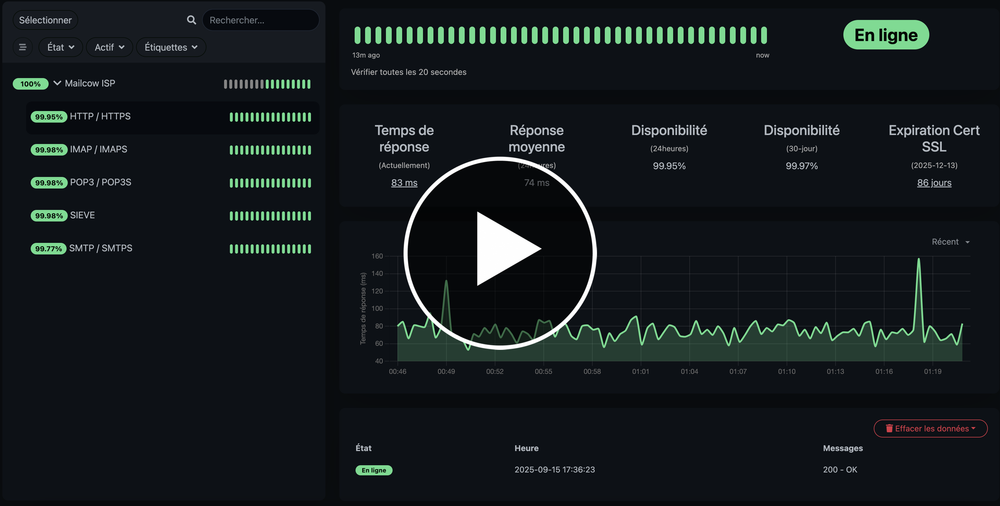

    

<h1 align="center">Mailcow ISP</h1>

    ⭐ If you like this project, <strong>consider giving it a star</strong> — it really keeps us motivated! ⭐ 
    ⭐ Si ce projet vous plaît, <strong>pensez à lui mettre une étoile</strong> — ça nous motive énormément ! ⭐

&nbsp;

  
  
  
  
  
  

<strong>🇬🇧 English Version (click to expand)</strong>

### Our Approach to Automation

Many of you are looking for a "one-click" script to deploy this entire high-availability cluster. While this is the ultimate goal, the reality is that creating a truly robust and universal automation script for such a complex architecture is a significant undertaking.

Our philosophy is to release automation scripts **piece by piece** ("au compte-gouttes"), ensuring that each component is reliable, secure, and thoroughly tested before it becomes public.

This ensures the quality and stability of the project in the long term.

---

### Automation Roadmap

Here is the current status of our deployment scripts:

*   **🧠 Core HA Logic Scripts (`master.sh`, `backup.sh`, `monitor.sh`)**
    *   **Status:** ✅ **Available Now**
    *   *Description: The core orchestration engine is complete and stable.*

*   **⚙️ Initial Server Setup Script (Dependencies, Security)**
    *   **Status:** 🟡 **In Progress**
    *   *Description: A script to prepare a fresh server with all necessary packages and security hardening.*

*   **📦 Full One-Click Cluster Deployment Script**
    *   **Status:** 🔵 **Planned**
    *   *Description: The final script that will automate the entire setup, from server provisioning to the final HA configuration.*

---

### 🚀 Need a Production-Ready Cluster Today?

We understand that many projects have immediate needs and cannot wait for the full automation suite to be completed. The complexity of a manual setup (Keepalived, shared storage, security) can be daunting.

For this reason, we offer a **professional, turnkey deployment service** that delivers a fully configured, tested, and production-ready HA cluster, allowing you to focus on your business.

 

  <strong><a href="./help.md">➡️ Learn more about our Professional services in help.md</a></strong>

 

<strong>🇫🇷 Version Française (cliquer pour déplier)</strong>

### Notre Approche de l'Automatisation

Beaucoup d'entre vous recherchent un script "en un clic" pour déployer l'intégralité de ce cluster en haute disponibilité. Bien que ce soit l'objectif ultime, la réalité est que la création d'un script d'automatisation universel et véritablement robuste pour une architecture aussi complexe est un travail colossal.

Notre philosophie est de publier les scripts d'automatisation **progressivement** ("au compte-gouttes"), en s'assurant que chaque composant est fiable, sécurisé et rigoureusement testé avant d'être rendu public.

Cette approche garantit la qualité et la stabilité du projet sur le long terme.

---

### Feuille de Route de l'Automatisation

Voici l'état d'avancement de nos scripts de déploiement :

*   **🧠 Scripts de Logique HA (`master.sh`, `backup.sh`, `monitor.sh`)**
    *   **Statut :** ✅ **Disponibles Maintenant**
    *   *Description : Le moteur d'orchestration principal est complet et stable.*

*   **⚙️ Script d'Initialisation des Serveurs (Dépendances, Sécurité)**
    *   **Statut :** 🟡 **En Cours de Développement**
    *   *Description : Un script pour préparer un serveur vierge avec tous les paquets nécessaires et la sécurisation de base.*

*   **📦 Script de Déploiement Complet en Un Clic**
    *   **Statut :** 🔵 **Planifié**
    *   *Description : Le script final qui automatisera l'ensemble de l'installation, du provisionnement des serveurs à la configuration HA finale.*

---

### 🚀 Besoin d'un Cluster Prêt pour la Production Dès Aujourd'hui ?

Nous comprenons que de nombreux projets ont des besoins immédiats et ne peuvent pas attendre que la suite d'automatisation soit terminée. La complexité d'une installation manuelle (Keepalived, stockage partagé, sécurité) peut être décourageante.

Pour cette raison, nous proposons un **service de déploiement professionnel et clé en main** qui vous livre un cluster HA entièrement configuré, testé et prêt pour la production, vous permettant de vous concentrer sur votre activité.

 

  <strong><a href="./help.md">➡️ Découvrez nos services Professionnels dans help.md</a></strong>

 

<table tyle="width: 100%; table-layout:fixed; border:1px solid #ddd; border-collapse:collapse;">
  <tr>
    <th width="50%" style="padding:10px;">🇬🇧 <b>Anglais</b></th>
    <th width="50%" style="padding:10px;">🇫🇷 <b>Français</b></th>
  </tr>
  <tr>
    <td>Youtube demonstration, mailcow ISP - High availability in action. <b>Failure detection and automatic failover</b></td>
    <td>Démonstration Youtube, mailcow ISP - Haute disponibilité en action. <b>Détection de panne et basculement automatique</b></td>
  </tr>
  <tr>
    <td colspan="2" align="center" style="padding:15px; position:relative;"> 
      
      
    </td>
  </tr>
</table>

  

<table style="width: 100%; table-layout:fixed; border:1px solid #ddd; border-collapse:collapse;">
  <tr>
    <th width="50%">🇬🇧 <b>Anglais</b></th>
    <th width="50%">🇫🇷 <b>Français</b></th>
  </tr>
  <tr>
    <td>Youtube Demo, Mailcow ISP - <b>Automatic Registration</b></td>
    <td>Démonstration Youtube, mailcow ISP - <b>Inscription automatique</b></td>
  </tr>
  <tr>
    <td colspan="2" align="center">
         
      
     
    </td>
  </tr>
</table>

